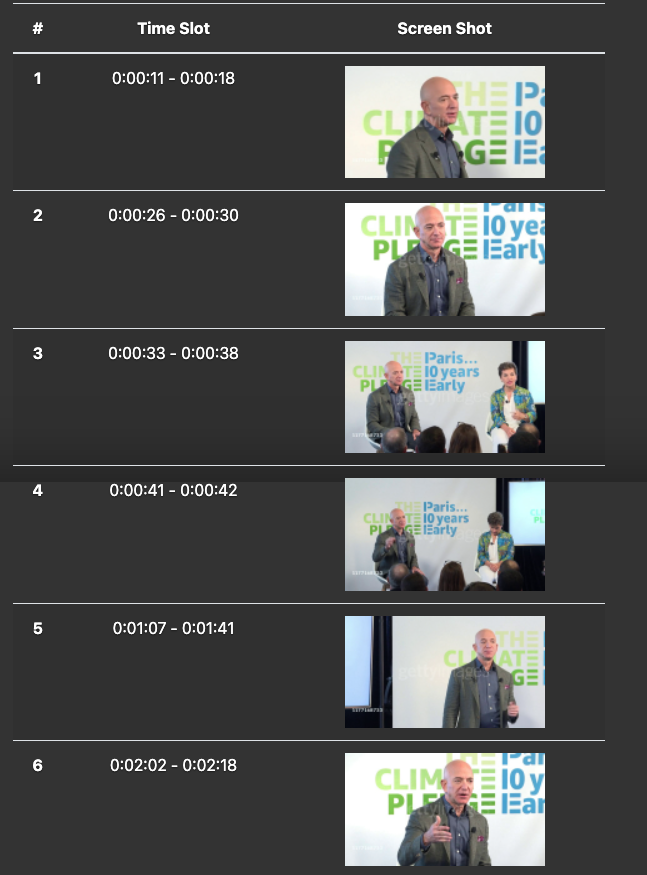

# cmu-17691-facetracing-app

This is a face tracing app used to capture the target person in a video.

### Run in Docker
```shell
docker run -it -p 8000:8000 mlp-app
```

---

### User Interface Example

##### Input


##### Output



---

### Tech Stack

<p align="left">
<a href="https://getbootstrap.com" target="_blank" rel="noreferrer"> 
 
</a>

<a href="https://www.djangoproject.com/" target="_blank" rel="noreferrer"> 
 
</a> 

<a href="https://heroku.com" target="_blank" rel="noreferrer"> 
 
</a>

 <a href="https://www.w3.org/html/" target="_blank" rel="noreferrer"> 
 
</a>

 <a href="https://developer.mozilla.org/en-US/docs/Web/JavaScript" target="_blank" rel="noreferrer"> 

 </a> 

<a href="https://www.python.org" target="_blank" rel="noreferrer"> 

 </a> 

<a href="https://github.com/serengil/deepface" target="_blank" rel="noreferrer"> 

 </a> 

</p>